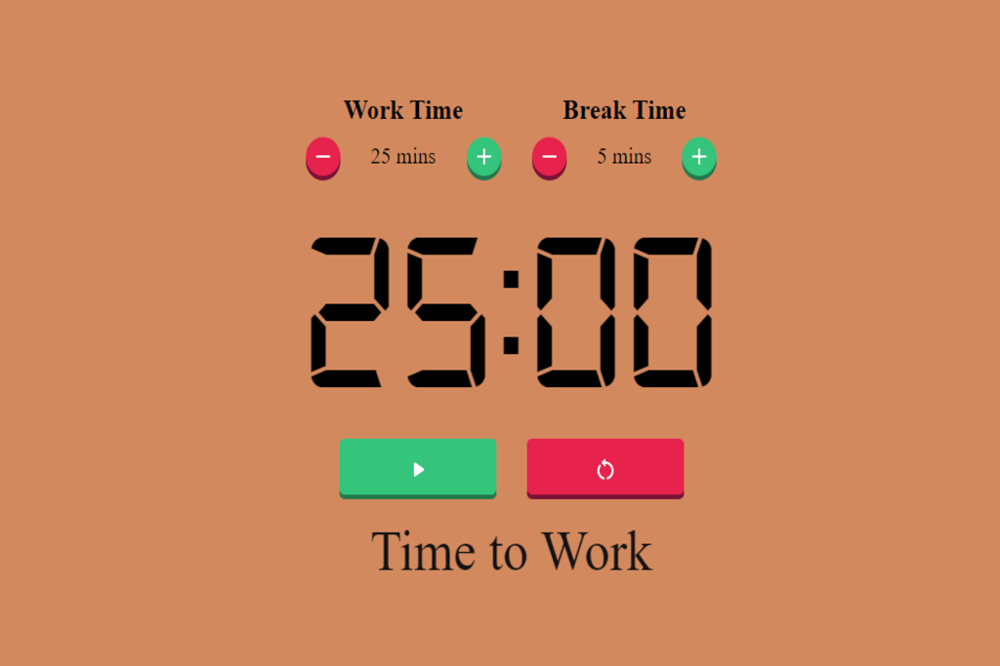

# React Pomodoro Clock

This project is a Pomodoro clock application written in React. Pomodoro is a productivity method that involves working in short time blocks followed by short breaks. This clock will help you stay focused and improve your productivity.

## Features

- Intuitive and user-friendly interface
- Customizable work and break times
- Sound notifications for time changes

## Installation

To run this project locally, follow these steps:

1. Clone this repository to your computer
2. Open a terminal and navigate to the project folder
3. Run `npm install` to install the dependencies
4. Run `npm start` to start the application

## Contribution

This project is open-source and available for contribution. If you'd like to contribute, please follow these steps:

1. Fork the repository
2. Create a branch with your changes
3. Make a pull request for your changes to be reviewed and merged

## License

This project is licensed under the MIT license. For more information, please review the license file in the repository.

## Screenshot

  

